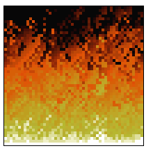
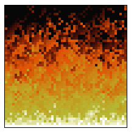
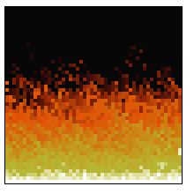
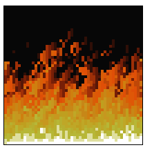

# Pixel Arte de Fogo (fogo do Doom) em Js

um mine projeto onde fiz um fogo com js seguindo os passos do video do [Felipe](https://youtu.be/fxm8cadCqbs?si=bkCJAxp5q9qQR36c), onde ele ensinou a fazer esse fogo em js.

## Sobre o projeto

O projeto em si é bem simples, consiste em um array que vai sendo colorido de uma forma em especifico o que lembra o fogo, tendo até efeito de vento.

dando até opção de mudar certos fatores dependendo da variavel, como a intensidade e a direção.

